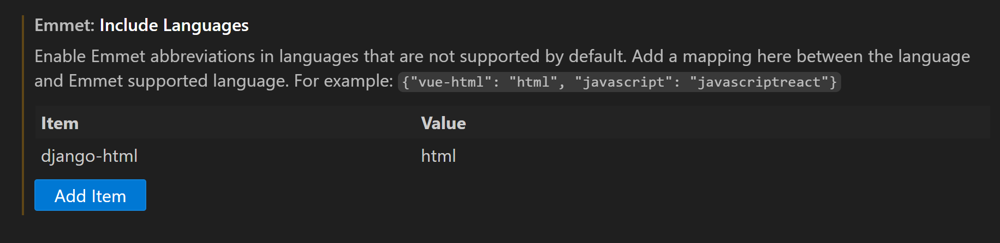

# django-092024-AM

>py --version

>pip install pipenv

create a project folder 

>mkdir hello-world
>cd hello-world

>py -m venv .venv

Activate the env
>.\.venv\Scripts\activate

>(.venv) PS D:\hello-world> py -m pip install Django

To create the django project
>django-admin startproject helloworld

>cd helloworld
>py .\manage.py runserver 8001

create views.py file with the following code

from django.http import HttpResponse

def homepage(request):
    return HttpResponse("Welcome to CBC!")

def about(request):
    return HttpResponse("This is our about page text")

update the urls.py file with the following changes

from . import views

urlpatterns = [
    path("admin/", admin.site.urls),
    path("", views.homepage),
    path("about/", views.about),

### App and Templates

start the env

>cd helloworld

>py .\manage.py startapp posts

### Create a django app

>py .\manage.py migrate
>py .\manage.py makemigrations

>py .\manage.py shell 

>>> from posts.models import Post
>>> p = Post()
>>> p
>>> p.title = "My First post"
>>> p.save()

>>> Post.objects.all()
>>> Post.objects.all().values()

now test admin 
http://127.0.0.1:8005/admin/login/?next=/admin/

to create a super user

>py .\manage.py createsuperuser

jobzila
Pa55w.rd

